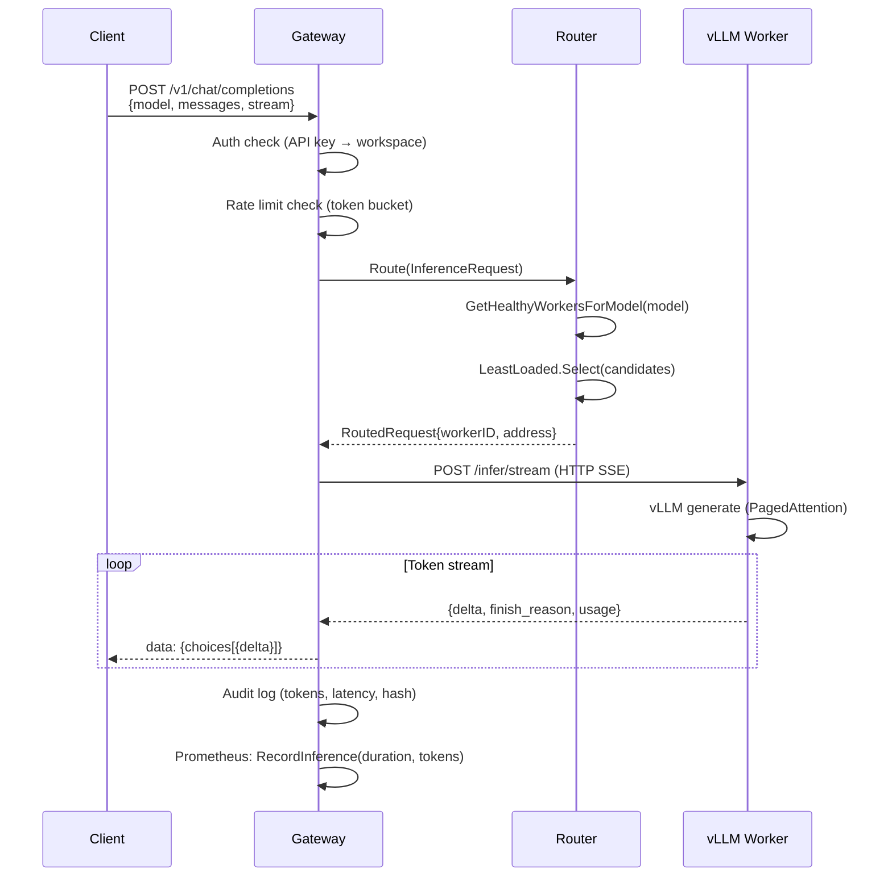
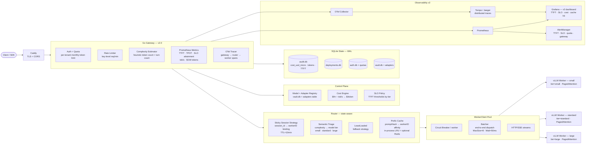
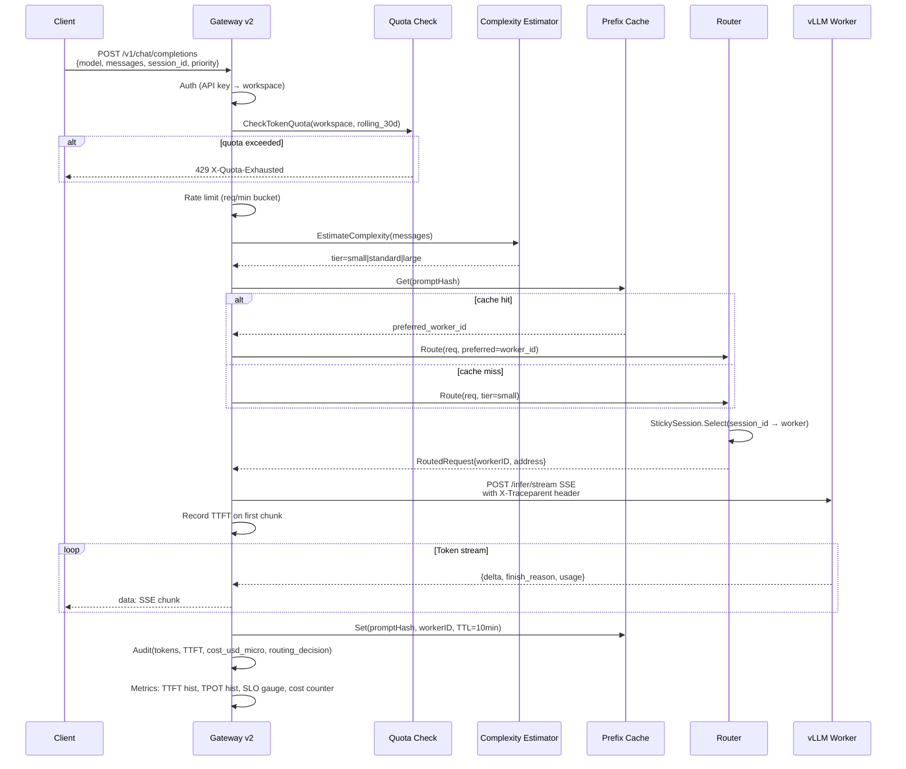
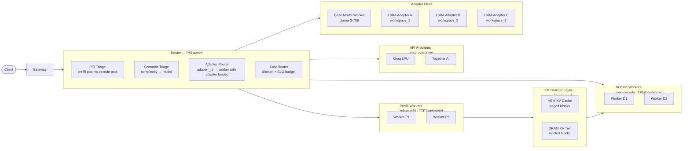

# Infera Platform Roadmap
## From v1.2.0 to Production-Grade Inference Platform

> **Scope:** 2-month sprint (Phase 1 complete) + long-term vision (Phase 2 & 3)
> **Last updated:** 2026-03-17
> **Current release:** v1.2.0
> **Strategic framing:** Build the router + state layer + SLO/cost control plane as the moat. Inference engines and hardware are pluggable commodities.

---

## Table of Contents

1. [Current State Assessment (v1.2.0)](#1-current-state-assessment-v120)
2. [Current Architecture Diagram](#2-current-architecture-diagram)
3. [2-Month Sprint Plan](#3-2-month-sprint-plan)
4. [Target Architecture (End of Month 2)](#4-target-architecture-end-of-month-2)
5. [KPIs We Are Racing Toward](#5-kpis-we-are-racing-toward)
6. [Phase 2: Routing as Product (6–12 months)](#6-phase-2-routing-as-product-612-months)
7. [Phase 3: State Plane + Disaggregation (12–24 months)](#7-phase-3-state-plane--disaggregation-1224-months)
8. [Long-Term Architecture Diagram](#8-long-term-architecture-diagram)
9. [Architectural Gap Summary](#9-architectural-gap-summary)

---

## 1. Current State Assessment (v1.2.0)

### What's Solid

| Component | File(s) | Status |
|---|---|---|
| OpenAI-compatible API + SSE streaming | `gateway/gateway.go` | ✅ Production |
| Multi-provider GPU abstraction (RunPod, Vast.ai) | `providers/` | ✅ Production |
| Per-worker circuit breakers | `gateway/circuit_breaker.go` | ✅ Production |
| Token-bucket rate limiting per API key | `gateway/rate_limiter.go` | ✅ Production |
| Three routing strategies (LeastLoaded default) | `router/strategy/` | ✅ Production |
| Worker registry with heartbeat health eviction | `router/registry/registry.go` | ✅ Production |
| Inference audit log (token counts, latency) | `audit/store.go` | ✅ Production |
| Deployment history + auto-verification | `deployments/store.go` | ✅ Production |
| Prometheus + Grafana + AlertManager | `deploy/observability/` | ✅ Production |
| Model registry (vault.db) | `vault/` | ✅ Production |
| API key auth + workspace scoping | `auth/` | ✅ Production |
| Request batcher (infrastructure) | `router/batcher/batcher.go` | ⚠️ Not wired end-to-end |

### Critical Gaps (blocking Phase 1)

| Gap | Impact | Effort |
|---|---|---|
| No TTFT/TPOT Prometheus histograms | Can't measure or alert on primary latency SLOs | **Low — 1 day** |
| Batcher not wired end-to-end | Throughput ceiling lower than it needs to be | **Medium — 2 days** |
| No sticky/session-affinity routing | Multi-turn chat causes re-prefill on every turn | **Low — 2 days** |
| No per-tenant token quota enforcement | Billing foundation incomplete | **Medium — 3 days** |
| No SLO attainment metric | Flying blind on service quality | **Low — 1 day** |
| No OpenTelemetry tracing | No latency root-cause capability | **Medium — 3 days** |
| No cost-per-token signal in routing | Can't make cost-aware dispatch decisions | **Low — 2 days** |

### Existing Hooks That Make Gaps Cheaper to Close

These are already in the codebase and accelerate the roadmap:

- **`hashPrompt()` in `gateway.go`** — SHA-256 over all messages. Currently written to audit log. This is the exact lookup key needed for prefix KV cache. Zero design work.
- **`WorkerInfo.Tags map[string]string`** in `pkg/types/worker.go` — Ready to carry `role=prefill` or `role=decode` tags for future disaggregation, or `tier=small` / `tier=large` for semantic routing. No schema change needed.
- **`TimeToFirstTokenMS` in `WorkerInferResponse`** (`worker_client.go:93`) — Workers already return TTFT. It's stored in the audit log but never emitted as a Prometheus metric. A one-hour change closes the most critical observability gap.
- **`proto/inference.proto`** — Already defines `InferBatch`, `Priority`, and `Cancel`. Right abstractions for adapter-native serving and phase disaggregation are designed, just not implemented.
- **`inFlightRequests int64`** in `gateway.go` — Atomic in-flight counter exists. Needs to feed into autoscaling signal.

---

## 2. Current Architecture Diagram

```mermaid
flowchart LR
    Client([Client / SDK\nOpenAI-compat]) --> Caddy[Caddy\nTLS + CORS]
    Caddy --> GW

    subgraph GW[Go Gateway — v1.2.0]
        direction TB
        Auth[Auth Middleware\nAPI Key + Workspace]
        RL[Rate Limiter\nToken Bucket / key\n60 req/min default]
        MW[Middleware Stack\nRecovery · RequestID · BodyLimit]
        M[Prometheus Metrics\nHTTP duration · in-flight\ninference total latency ⚠️ no TTFT]
    end

    GW --> Router

    subgraph Router[Router — load-aware only]
        direction TB
        Strat[Strategy Engine\nLeastLoaded · LatencyBased · RoundRobin]
        Reg[Worker Registry\nHeartbeat eviction 30s]
        Batch[Batcher\nMaxSize=8 · Wait=50ms\n⚠️ not wired end-to-end]
    end

    Router --> WC

    subgraph WC[WorkerClient]
        direction TB
        CB[Circuit Breaker\nClosed → Open → HalfOpen]
        HTTP[HTTP /infer\nHTTP /infer/stream SSE]
    end

    WC --> W1[vLLM Worker A\nPagedAttention\nStreamingSSE]
    WC --> W2[vLLM Worker B\nPagedAttention\nStreamingSSE]
    WC --> W3[vLLM Worker N...]

    subgraph State[SQLite State — WAL mode]
        direction TB
        AuditDB[(audit.db\ntokens · latency · hash)]
        DeployDB[(deployments.db\nhistory · verification)]
        AuthDB[(auth.db\nkeys · workspaces)]
        VaultDB[(vault.db\nmodel registry)]
        CostDB[(costs.db\nhourly spend)]
    end

    GW --> State

    subgraph Obs[Observability]
        direction TB
        Prom[Prometheus\ngw + worker scrape]
        Grafana[Grafana Dashboard\npre-provisioned JSON]
        AM[AlertManager\n5xx · gateway down · heartbeat]
    end

    GW --> Prom
    W1 --> Prom
    Prom --> Grafana
    Prom --> AM

    subgraph Providers[GPU Providers]
        direction TB
        RunPod[RunPod\nGraphQL API]
        VastAI[Vast.ai\nREST API]
        Mock[Mock\nTesting]
    end

    GW --> Providers

    subgraph FE[Frontend — React]
        direction TB
        Dash[Dashboard\nworkers · costs · deployments]
        Play[Playground\nstreaming chat]
        Inst[Instances\nprovision · terminate]
        Keys[API Keys + Workspace Admin]
    end

    FE --> GW
```



### Current Data Flow — Single Inference Request



**What's missing in this flow:**
- TTFT is not recorded as a separate metric (only total duration)
- Worker is selected without knowing KV cache state — re-prefill on every chat turn
- No session affinity — turn N may land on a different worker than turn N-1

---

## 3. 2-Month Sprint Plan

### Overview

```
Month 1: Control Plane Hardening
  Week 1: Observability — TTFT/TPOT metrics, SLO alerting, batcher fix
  Week 2: Routing — sticky sessions, SLO tiers, cost signal
  Week 3: Token economics — per-tenant quotas, billing dimension tracking
  Week 4: Tracing + SLO attainment — OTel, Grafana SLO panels

Month 2: Routing as Product
  Week 5: Semantic triage — complexity routing, interactive vs batch
  Week 6: Prefix cache — Redis, prompt-hash → worker affinity
  Week 7: Adapter registry foundation — vault schema + routing hook
  Week 8: Integration + hardening — end-to-end testing, v2.0 release prep
```

---

### Week 1: Observability — TTFT/TPOT + Batcher

**Goal:** Know what your latency actually looks like. Make the batcher work.

#### Task 1.1 — TTFT histogram in Prometheus ⭐ highest ROI
**File:** `go/internal/gateway/metrics.go`
**Change:** Add two new histograms to `GatewayMetrics`:
```go
inferenceTTFT     *prometheus.HistogramVec  // labels: model, stream, tier
inferenceTTPOT    *prometheus.HistogramVec  // labels: model, stream, tier
```
Buckets for TTFT: `[0.05, 0.1, 0.2, 0.5, 1.0, 2.0, 5.0, 10.0]`
Buckets for TPOT: `[0.005, 0.01, 0.025, 0.05, 0.1, 0.25, 0.5]`

**File:** `go/internal/gateway/gateway.go`
**Change:** In `handleChatCompletions`, capture the time of first token delivery and emit:
```go
metrics.RecordTTFT(model, stream, tier, ttftDuration)
metrics.RecordTPOT(model, stream, tier, interTokenDuration)
```
TTFT is already available in `WorkerInferResponse.Latency.TimeToFirstTokenMS` for non-streaming. For streaming, record wall-clock time to first SSE chunk delivery.

#### Task 1.2 — p95 TTFT alert in AlertManager
**File:** `deploy/observability/prometheus/rules/infera-alerts.yml`
**Add:**
```yaml
- alert: InferaInferenceTTFTHigh
  expr: |
    histogram_quantile(0.95,
      sum by (le, model) (rate(infera_gateway_inference_ttft_seconds_bucket[5m]))
    ) > 2.0
  for: 5m
  labels:
    severity: warning
  annotations:
    summary: p95 TTFT above 2s for {{ $labels.model }}
```

#### Task 1.3 — Wire the batcher end-to-end
**File:** `go/internal/router/router.go`
**Problem:** `onBatchReady` at line 231 only updates tracker state. It never dispatches to a worker.
**Fix:** `onBatchReady` should call the registered `dispatchBatch` function that picks a worker (via strategy), calls `WorkerClient.InferWithContext` for each request, and routes results back to per-request response channels. Add `batcher_dispatch_latency` histogram metric.

**File:** `go/internal/gateway/metrics.go`
**Add:**
```go
batchSize    *prometheus.HistogramVec  // labels: model
batchWaitMS  *prometheus.HistogramVec  // labels: model
```

**Acceptance criteria:**
- `infera_gateway_inference_ttft_seconds_bucket` visible in Prometheus
- AlertManager fires on simulated 3s TTFT
- Batcher dispatches and completes a request in integration test
- Grafana TTFT panel added to `infera-overview.json`

---

### Week 2: Routing — Sticky Sessions + SLO Tiers

**Goal:** Stop re-prefilling on every chat turn. Introduce request tiers.

#### Task 2.1 — Sticky session routing strategy
**File:** `go/internal/router/strategy/sticky_session.go` (new)
**Logic:**
```go
type StickySession struct {
    mu      sync.RWMutex
    table   map[string]string  // sessionID → workerID
    ttl     time.Duration
    expiry  map[string]time.Time
    fallback Strategy
}

func (s *StickySession) Select(req *types.InferenceRequest, candidates []*types.WorkerInfo) (*Selection, error) {
    // 1. Extract session_id from req.SessionID (new field)
    // 2. Look up preferred workerID in table
    // 3. If preferred worker is in candidates and healthy → return it
    // 4. Else fall back to s.fallback.Select()
    // 5. Record new session → worker binding
}
```

**File:** `go/pkg/types/types.go`
**Add to InferenceRequest:**
```go
SessionID string `json:"session_id,omitempty"`
Priority  string `json:"priority,omitempty"`  // "interactive" | "batch"
```

**File:** `go/internal/gateway/gateway.go`
**Change:** In `handleChatCompletions`, extract `X-Infera-Session-ID` header or `session_id` from request body, populate `InferenceRequest.SessionID`.

**File:** `go/internal/router/strategy/engine.go`
**Change:** Register `StickySession` wrapping `LeastLoaded` as a new strategy type `StrategyStickySession`.

#### Task 2.2 — Interactive vs batch SLO tiers
**File:** `go/internal/gateway/gateway.go`
**Change:** Read `X-Infera-Priority: interactive|batch` header. Tag `InferenceRequest.Priority`.

**File:** `go/internal/router/strategy/least_loaded.go`
**Change:** When priority is `batch`, increase the weight of throughput (queue depth) vs latency in the score. When priority is `interactive`, weight latency higher.

**File:** `go/internal/gateway/metrics.go`
**Change:** Add `tier` label to `inferenceTTFT` and `inferenceTTPOT` histograms.

#### Task 2.3 — hashPrompt as routing affinity key
**File:** `go/internal/gateway/gateway.go`
The `hashPrompt()` function already computes a SHA-256 over all messages. Extract the first-turn hash and include it in `InferenceRequest` as a `PromptHash` field. The sticky session strategy can use this as a secondary affinity key (same prompt prefix → prefer same worker).

**Acceptance criteria:**
- Multi-turn chat with `X-Infera-Session-ID: abc` routes all turns to the same worker (verify via worker_id in audit log)
- Worker failure triggers fallback to LeastLoaded, new binding
- `interactive` requests measurably lower p95 TTFT than `batch` under load test

---

### Week 3: Token Economics — Quotas + Cost Signal

**Goal:** Make $/1M tokens measurable. Enforce per-tenant hard limits.

#### Task 3.1 — Per-tenant token quota enforcement
**File:** `go/internal/auth/store.go`
**Add schema migration:**
```sql
ALTER TABLE workspaces ADD COLUMN monthly_token_quota INTEGER NOT NULL DEFAULT 0;
-- 0 = unlimited
```

**File:** `go/internal/gateway/gateway.go`
**Change:** In `handleChatCompletions`, before dispatching:
1. Call `authStore.GetRollingTokenUsage(workspaceID, thisMonth)` — sum from `audit.db`
2. Compare to `workspace.monthly_token_quota`
3. If exceeded → return HTTP 429 with `X-Quota-Exhausted: true`

**Performance note:** Cache the rolling sum in-memory with a 60-second TTL to avoid SQLite reads on every request.

#### Task 3.2 — Provider cost dimension in audit log
**File:** `go/internal/audit/store.go`
**Add schema migration:**
```sql
ALTER TABLE inference_audit ADD COLUMN cost_usd_micro INTEGER NOT NULL DEFAULT 0;
-- stored in micro-dollars to avoid floats. 1 = $0.000001
```

**File:** `go/internal/providers/manager.go`
**Add:** `GetCostPerToken(providerType, gpuType) float64` — looks up from `costs.db` (hourly cost ÷ measured throughput). Default fallback: H100 PCIe at $2.39/hr ÷ estimated tok/s.

**File:** `go/internal/gateway/gateway.go`
**Change:** After inference completes, compute `cost_usd_micro = cost_per_token × completion_tokens` and write to audit record.

#### Task 3.3 — $/1M tokens Grafana panel
**File:** `deploy/observability/grafana/dashboards/infera-overview.json`
**Add panel:**
```
$ / 1M output tokens = sum(cost_usd_micro) / sum(completion_tokens) * 1e6
```
Per model, per provider. Rolling 24h window.

**Acceptance criteria:**
- Workspace with `monthly_token_quota: 1000000` gets 429 after limit
- `cost_usd_micro` populated in audit log for all inference calls
- Grafana shows $/1M tokens by model

---

### Week 4: OpenTelemetry + SLO Attainment

**Goal:** Root-cause latency. Track % of requests meeting SLO.

#### Task 4.1 — OpenTelemetry tracing (gateway)
**File:** `go/go.mod`
**Add:** `go.opentelemetry.io/otel`, `go.opentelemetry.io/otel/exporters/otlp/otlptrace/otlptracehttp`

**File:** `go/cmd/gateway/main.go`
**Add:** Initialize OTLP exporter pointing to `OTEL_EXPORTER_OTLP_ENDPOINT` env var. Default: `localhost:4318`.

**File:** `go/internal/gateway/middleware.go`
**Add:** `otelhttp.NewHandler(mux, "infera-gateway")` wrapping the entire mux.

**Spans to add:**
```
infera.gateway.request          (root span: auth → rate limit → route → infer)
  infera.router.select          (strategy selection time)
  infera.worker.infer           (time to first token from worker)
  infera.worker.stream          (full stream duration)
```

**File:** `go/internal/gateway/worker_client.go`
**Change:** Propagate `ctx` trace context in `X-Traceparent` header to vLLM worker (worker doesn't need OTel to benefit from gateway-side spans).

#### Task 4.2 — SLO attainment metric
**File:** `go/internal/gateway/metrics.go`
**Add:**
```go
sloAttainment *prometheus.GaugeVec  // labels: model, tier, slo_threshold_ms
```

Update every 30 seconds: `count(TTFT < threshold) / count(all)` from a rolling in-memory ring buffer of last 1000 TTFT samples per model.

**Default SLO thresholds:**
- `interactive`: TTFT < 1000ms → target 95%
- `batch`: TTFT < 5000ms → target 99%

#### Task 4.3 — Grafana SLO dashboard
**Add panels to `infera-overview.json`:**
1. TTFT p50 / p95 / p99 by model (time series)
2. TPOT p50 / p95 by model (time series)
3. SLO attainment % by tier (stat panel, red < 90%, green > 95%)
4. tok/s per GPU (derived from completion_tokens / inference_duration / worker_count)
5. $/1M tokens by model (stat panel)

**Acceptance criteria:**
- Traces visible in Grafana (via Tempo sidecar or Jaeger)
- SLO attainment gauge updates in Grafana
- Can trace a single slow request from gateway → router → worker in one view

---

### Week 5: Semantic Triage Router

**Goal:** Route simple queries to smaller/cheaper models automatically.

#### Task 5.1 — Model tier annotation in vault
**File:** `go/internal/vault/` (schema migration)
**Add to vault models table:**
```sql
ALTER TABLE vault_models ADD COLUMN tier TEXT NOT NULL DEFAULT 'standard';
-- values: 'small' | 'standard' | 'large'
ALTER TABLE vault_models ADD COLUMN cost_tier INTEGER NOT NULL DEFAULT 2;
-- 1=cheap, 2=standard, 3=premium
```

Pre-populate: Phi-2/Mistral-3B → `small`, Mistral-7B/Llama-8B → `standard`, Llama-70B → `large`.

#### Task 5.2 — Complexity estimator
**File:** `go/internal/gateway/complexity.go` (new)
**Logic:**
```go
func EstimateComplexity(req *ChatCompletionRequest) ComplexityScore {
    totalTokens := estimateTokens(req.Messages)  // ~4 chars/token heuristic
    hasSystemPrompt := hasSystemRole(req.Messages)
    multiTurn := len(req.Messages) > 3

    score := float64(totalTokens) / 1000.0
    if hasSystemPrompt { score += 0.2 }
    if multiTurn { score += 0.3 }
    // score < 0.3 → small, 0.3-0.8 → standard, > 0.8 → large
}
```

#### Task 5.3 — Tiered routing in gateway
**File:** `go/internal/gateway/gateway.go`
**Change:** In `handleChatCompletions`, if request doesn't specify a model explicitly (or model is `auto`):
1. Compute complexity score
2. Look up vault for models matching the tier
3. Route to matching worker pool
4. Log `routing_decision: semantic_triage` in audit record

**File:** `go/internal/gateway/metrics.go`
**Add:** `semantic_triage_decisions_total` counter with labels `{from_tier, to_tier, reason}`.

**Acceptance criteria:**
- Requests with `model: auto` route to small model for short/simple inputs
- `routing_decision` field in audit log shows tier decision
- A/B test: compare cost/request for auto-routed vs fixed-model traffic

---

### Week 6: Prefix Cache (Prompt Affinity)

**Goal:** Stop re-computing identical or common prefixes. Route cache hits to workers that have the KV state.

#### Task 6.1 — In-process prefix cache (start simple)
**File:** `go/internal/cache/prefix_cache.go` (new package)
**Data structure:** LRU cache keyed by `promptHash` (already computed in `hashPrompt()`):
```go
type PrefixCache struct {
    mu      sync.RWMutex
    entries map[string]*CacheEntry  // hash → {workerID, expiresAt}
    maxSize int
    ttl     time.Duration
}

type CacheEntry struct {
    WorkerID  string
    Model     string
    CreatedAt time.Time
    HitCount  int
}
```

Start with `maxSize=1000`, `ttl=10min`. This doesn't cache actual KV blocks yet — it caches worker affinity for a given prompt hash. The worker's vLLM engine will have the KV in its own PagedAttention pool if the request hits the same worker shortly after.

#### Task 6.2 — Cache-aware routing
**File:** `go/internal/router/router.go`
**Change:** Before calling `strategyEngine.SelectWorker()`, check `prefixCache.Get(req.PromptHash)`:
- Cache hit + target worker is healthy → prefer that worker (bypass strategy engine)
- Cache hit + target worker unhealthy → evict from cache, fall through to strategy
- Cache miss → strategy selects, write to cache after successful inference

**File:** `go/internal/gateway/metrics.go`
**Add:**
```go
prefixCacheHits   prometheus.Counter
prefixCacheMisses prometheus.Counter
prefixCacheHitRate prometheus.Gauge  // updated every 30s
```

#### Task 6.3 — (Optional) Redis backend for multi-instance deployments
**File:** `go/internal/cache/prefix_cache.go`
**Add:** Constructor that accepts an optional Redis client. If Redis is configured (`INFERA_REDIS_URL` env), use it as the backing store. Falls back to in-process if Redis is unavailable.

**Acceptance criteria:**
- Repeated identical prompt hash → same worker in audit log > 90% of time
- `prefix_cache_hit_rate` gauge visible in Grafana
- No measurable latency regression on cache miss path

---

### Week 7: Adapter Registry Foundation

**Goal:** Design the data model for LoRA adapters so the vault can serve as an adapter catalog.

#### Task 7.1 — Adapter registry schema
**File:** `go/internal/vault/` (new migration)
```sql
CREATE TABLE IF NOT EXISTS adapters (
    id              TEXT PRIMARY KEY,
    workspace_id    TEXT NOT NULL,
    name            TEXT NOT NULL,
    base_model_id   TEXT NOT NULL REFERENCES vault_models(id),
    source_path     TEXT NOT NULL,  -- HF repo or s3:// path
    rank            INTEGER NOT NULL DEFAULT 16,
    size_bytes      INTEGER NOT NULL DEFAULT 0,
    created_at      TEXT NOT NULL,
    tags            TEXT NOT NULL DEFAULT '[]'
);
CREATE INDEX IF NOT EXISTS idx_adapters_workspace ON adapters(workspace_id);
CREATE INDEX IF NOT EXISTS idx_adapters_base_model ON adapters(base_model_id);
```

#### Task 7.2 — Adapter CRUD endpoints
**File:** `go/internal/vault/handlers.go`
**Add routes:**
- `GET /api/vault/adapters` — list adapters (workspace-scoped)
- `POST /api/vault/adapters` — register adapter (admin)
- `DELETE /api/vault/adapters/{id}` — remove adapter (admin)
- `GET /api/vault/adapters/{id}` — adapter details

#### Task 7.3 — Worker heartbeat: loaded adapters
**File:** `go/pkg/types/worker.go`
**Add to `WorkerInfo`:**
```go
LoadedAdapters []LoadedAdapter `json:"loaded_adapters"`
```
```go
type LoadedAdapter struct {
    AdapterID   string `json:"adapter_id"`
    BaseModelID string `json:"base_model_id"`
    Rank        int    `json:"rank"`
    LoadedAt    time.Time `json:"loaded_at"`
}
```

**File:** `go/internal/router/registry/registry.go`
**Add:** `adapterIndex map[string]map[string]struct{}` alongside `modelIndex`. `GetWorkersForAdapter(adapterID)` method.

**Acceptance criteria:**
- Admin can register an adapter via POST /api/vault/adapters
- Workers report loaded adapters in heartbeat
- Router can query workers by adapter ID (not yet routing on it — Week 8)

---

### Week 8: Integration Hardening + v2.0 Release

**Goal:** Validate the full stack end-to-end. Cut a release.

#### Task 8.1 — End-to-end integration test suite
**File:** `go/internal/gateway/gateway_contract_test.go` (extend existing)
**Add scenarios:**
- [ ] Multi-turn chat with session ID → confirm same worker in audit log
- [ ] Quota exhaustion → 429 with correct headers
- [ ] Semantic triage: `model: auto` + short prompt → small tier worker
- [ ] Prefix cache hit: identical prompt twice → same worker second time
- [ ] TTFT histogram populated after streaming request

#### Task 8.2 — Load test baseline
**Tool:** `k6` or `hey`
**Scenarios:**
1. 50 concurrent streaming requests, single model, 2 workers → measure p95 TTFT
2. 100 concurrent requests, mixed interactive/batch → measure SLO attainment
3. Same prompt repeated 100 times → measure cache hit rate
4. Ramp to quota limit → confirm 429 cutoff

Record baseline numbers as `v2.0` benchmark in this doc.

#### Task 8.3 — Grafana dashboard v2
Update `infera-overview.json` with all new panels:
- TTFT p50/p95/p99 by model and tier
- SLO attainment % by tier (goal line at 95%)
- Prefix cache hit rate
- tok/s per GPU (throughput efficiency)
- $/1M tokens by model
- Semantic triage decision breakdown
- Session affinity rate (% requests hitting cached worker)

#### Task 8.4 — v2.0 release checklist
- [ ] All Week 1–7 acceptance criteria green
- [ ] Load test baseline recorded
- [ ] Grafana dashboard exported + committed
- [ ] AlertManager rules cover TTFT, SLO attainment, quota exhaustion
- [ ] `CHANGELOG.md` updated with v2.0 highlights
- [ ] `README.md` updated with new headers/env vars
- [ ] Migration scripts idempotent and tested

---

## 4. Target Architecture (End of Month 2)



### Updated Data Flow — v2.0 Inference Request



---

## 5. KPIs We Are Racing Toward

These are the exact metrics the doc identifies as mandatory. We track all of them by end of Month 2.

| KPI | How Measured | Target (Month 2) | Source |
|---|---|---|---|
| **p50 TTFT** | `histogram_quantile(0.5, infera_gateway_inference_ttft_seconds_bucket)` | < 500ms for `small` tier | metrics.go Task 1.1 |
| **p95 TTFT** | `histogram_quantile(0.95, ...)` by model | < 2s for `standard` tier | AlertManager Task 1.2 |
| **p50 TPOT / ITL** | `histogram_quantile(0.5, infera_gateway_inference_tpot_seconds_bucket)` | < 50ms | metrics.go Task 1.1 |
| **tok/s per GPU** | `sum(completion_tokens) / sum(inference_duration_seconds) / worker_count` | Baseline established | Grafana Task 8.3 |
| **SLO attainment** | `% requests with TTFT < threshold` | > 95% interactive, > 99% batch | metrics.go Task 4.2 |
| **$/1M tokens** | `sum(cost_usd_micro) / sum(completion_tokens) * 1e6` | Measured and visible | audit.db Task 3.2 |
| **Cache hit rate** | `prefix_cache_hits / (hits + misses)` | > 30% on multi-turn traffic | cache Task 6.2 |
| **GPU utilization** | Worker heartbeat `gpu_utilization` → Prometheus | > 70% under load | existing WorkerStats |
| **Session affinity rate** | `% requests hitting same worker as previous turn` | > 80% on active sessions | audit log analysis |

---

## 6. Phase 2: Routing as Product (6–12 months)

### What Changes

- **Prefill/decode disaggregation** — Workers tagged as `role=prefill` or `role=decode` via existing `WorkerInfo.Tags`. Router implements P/D-aware dispatch: new request → prefill worker → async KV transfer → decode worker.
- **Hierarchical KV cache** — Prefix cache layer evolves: hot entries in-process DRAM, warm entries Redis, cold entries SSD. `LMCache` semantics. KV block IDs replace full messages in the worker protocol.
- **True multi-LoRA serving** — Adapter registry (built Week 7) used by router to select workers carrying a specific adapter. Workers report adapter hotset. Strategy: group by adapter to minimize swaps.
- **Cost-aware multi-backend routing** — Hosted inference APIs (Groq, Together) added as "API providers" (no instance provisioning). Router selects provider based on `$/token × expected_tokens + latency_SLO_budget`.

### Phase 2 Architecture Preview



### Phase 2 KPIs

| KPI | Target |
|---|---|
| Adapters active per GPU | > 10 concurrent LoRA adapters per base model |
| Adapter cache hit rate | > 70% (adapter is warm when request arrives) |
| KV transfer time % of request latency | < 10% of total TTFT |
| % traffic safely routed to cheaper tier | > 30% on mixed workloads |
| Goodput per GPU | Measured: SLO-satisfying req/s/GPU |

---

## 7. Phase 3: State Plane + Disaggregation (12–24 months)

### What Changes

- **Full inter-node prefill/decode disaggregation** — Separate GPU clusters for prefill vs decode. KV transfer over RDMA/NVLink or optimized software scheduler. Based on DistServe patterns (+7× goodput on bursty workloads).
- **Rack-scale KV fabric** — `HBM → DRAM → SSD → remote store` hierarchy. Eviction policies aware of session patterns, not just LRU. LMCache or Mooncake Store integration.
- **Multi-backend policy routing at scale** — SLO-tiered dispatch across GPU pool + ASIC (Groq LPU) + TPU + serverless. The router knows $/token × latency SLO and picks the cheapest backend that can meet the deadline.
- **Inference control plane as a product** — Token-based autoscaling (queue depth + TPOT → scale signal). Canary/A-B deployment for models. Rollback triggered by tail latency regression. This is what KServe calls the control plane / data plane separation.

### Phase 3 KPIs

| KPI | Target |
|---|---|
| SLO attainment under burst (p99 TTFT/TPOT) | > 99% p99 at 2× average load |
| Goodput per GPU | +2–4× vs Phase 1 baseline (PagedAttention paper reference) |
| KV transfer as % of request latency | < 5% (within NVLink domain) |
| State-tier hit rates | HBM > 60%, DRAM 25%, SSD < 15% |
| Blended $/request | Measurably below single-provider baseline |

---

## 8. Long-Term Architecture Diagram

```mermaid
flowchart LR
    Client([Client / SDK]) --> LLMGateway

    subgraph LLMGateway[LLM Gateway — Edge Layer]
        direction TB
        AuthQ[Auth + Quota\nper-tenant token budgets]
        SLOClass[SLO Classifier\ninteractive · standard · batch · flex]
        TokenPolicy[Token Economics Policy\nrouting objective: min cost s.t. SLO]
        OTelEdge[OTel Trace Root]
    end

    LLMGateway --> ControlPlane

    subgraph ControlPlane[Infera Control Plane]
        direction TB
        ModelReg[Model + Adapter Registry\nvault.db + adapters]
        SLOEngine[SLO + Cost Policy Engine\nSLO budgets × backend costs]
        Rollout[Rollout Manager\ncanary · A/B · automatic rollback]
        AutoScale[Token-based Autoscaler\nqueue depth + TPOT → scale signal]
        TelPipeline[Telemetry Pipeline\nOTel → Prometheus → Grafana]
    end

    LLMGateway --> InferaRouter

    subgraph InferaRouter[Infera Router — State-aware]
        direction TB
        PDRouter[P/D-aware Router\nnew req → prefill → decode binding]
        SemRouter[Semantic Triage\ncomplexity → model tier]
        AdaRouter[Adapter Router\nadapter_id → warm worker]
        BackendSel[Backend Selector\nGPU pool · ASIC · TPU · serverless]
        KVRouter[KV-locality Router\nprefixHash → worker with KV state]
    end

    InferaRouter --> DataPlane

    subgraph DataPlane[Data Plane Backends]
        subgraph GPU[GPU Cluster]
            subgraph PPool[Prefill Pool]
                PP1[Prefill Worker]
                PP2[Prefill Worker]
            end
            subgraph DPool[Decode Pool]
                DP1[Decode Worker]
                DP2[Decode Worker]
            end
        end

        subgraph AdaFleet[Adapter Fleet]
            Base1[Base Model\nLlama-3-70B]
            LAs[LoRA Adapters\nA · B · C · D · ...]
        end

        subgraph External[External Backends]
            GroqLPU[Groq LPU\nhosted API]
            TPUPool[TPU Pool]
            ServerlessInf[Serverless Inference\nAWS Inferentia]
        end
    end

    subgraph StatePlane[State Plane — KV System]
        direction TB
        HBM[HBM KV Cache\npaged blocks — vLLM PagedAttention]
        DRAM[Host DRAM KV Tier\nevicted warm blocks]
        SSD[Local SSD KV Tier\ncold blocks]
        Remote[Remote KV Store\nRedis · Distributed · LMCache]
        KVSched[Cache-aware Scheduler\neviction + prefetch policy]
    end

    PPool --> KVXfer[KV Transfer\nasync block · NIXL/RDMA]
    KVXfer --> DPool
    GPU --- StatePlane
    StatePlane --- KVSched

    subgraph ObsStack[Observability Stack]
        direction TB
        PromFull[Prometheus\nTTFT · TPOT · SLO · cache tiers · cost]
        OTelCollect[OTel Collector\ndistributed traces]
        GrafanaFull[Grafana\nSLO boards · economics · tracing]
        AMFull[AlertManager\np99 TTFT · SLO attainment · cost spike]
    end

    DataPlane --> ObsStack
    StatePlane --> ObsStack
    ControlPlane --> ObsStack
```



---

## 9. Architectural Gap Summary

| Breakthrough | Current State | End of Month 2 | Phase 2 (12mo) | Phase 3 (24mo) |
|---|---|---|---|---|
| **Disaggregated prefill/decode** | ❌ Missing | ❌ Not in scope | 🔄 P/D worker tags + routing | ✅ Full inter-node disaggregation |
| **KV cache as memory system** | ❌ Missing | 🟡 Prefix affinity cache (worker-level) | 🔄 Block-level prefix reuse (Redis) | ✅ HBM→DRAM→SSD hierarchy |
| **Heterogeneous routing** | 🟡 Load-aware | ✅ Session-sticky + SLO tier + semantic triage | 🔄 Multi-backend cost routing | ✅ Full policy engine |
| **Adapter-native serving** | ❌ Missing | 🟡 Registry + schema | 🔄 Adapter routing + LRU eviction | ✅ S-LoRA-style paged adapters |
| **Inference control plane** | 🟡 Partial | ✅ TTFT/TPOT + SLO + quotas + OTel traces | 🔄 Autoscaling + canary | ✅ Full control plane |

**Legend:** ❌ Missing · 🟡 Partial/Foundation · 🔄 In progress · ✅ Complete

---

## Appendix: File Change Index for Month 1–2

| Week | File | Change Type |
|---|---|---|
| 1 | `go/internal/gateway/metrics.go` | Add TTFT/TPOT histograms, batch metrics |
| 1 | `go/internal/gateway/gateway.go` | Emit TTFT on first chunk, emit TPOT per token |
| 1 | `go/internal/router/router.go` | Wire batcher dispatch callback |
| 1 | `go/internal/router/batcher/batcher.go` | Add dispatch function hook |
| 1 | `deploy/observability/prometheus/rules/infera-alerts.yml` | TTFT alert rule |
| 1 | `deploy/observability/grafana/dashboards/infera-overview.json` | TTFT panel |
| 2 | `go/pkg/types/types.go` | Add `SessionID`, `Priority` to InferenceRequest |
| 2 | `go/internal/router/strategy/sticky_session.go` | New strategy |
| 2 | `go/internal/router/strategy/engine.go` | Register sticky session |
| 2 | `go/internal/gateway/gateway.go` | Extract session_id + priority headers |
| 3 | `go/internal/auth/store.go` | Add quota column + rolling usage query |
| 3 | `go/internal/audit/store.go` | Add `cost_usd_micro` column |
| 3 | `go/internal/providers/manager.go` | `GetCostPerToken()` method |
| 3 | `go/internal/gateway/gateway.go` | Quota check + cost write to audit |
| 3 | `deploy/observability/grafana/dashboards/infera-overview.json` | Cost panel |
| 4 | `go/go.mod` | Add OTel deps |
| 4 | `go/cmd/gateway/main.go` | Init OTel tracer |
| 4 | `go/internal/gateway/middleware.go` | OTel HTTP middleware |
| 4 | `go/internal/gateway/worker_client.go` | Propagate trace context |
| 4 | `go/internal/gateway/metrics.go` | SLO attainment gauge |
| 4 | `deploy/observability/grafana/dashboards/infera-overview.json` | SLO panels |
| 5 | `go/internal/gateway/complexity.go` | New: complexity estimator |
| 5 | `go/internal/gateway/gateway.go` | Semantic triage on `model: auto` |
| 5 | `go/internal/gateway/metrics.go` | Triage decision counter |
| 5 | `go/internal/vault/` | Tier + cost_tier columns in migration |
| 6 | `go/internal/cache/prefix_cache.go` | New package: LRU prefix cache |
| 6 | `go/internal/router/router.go` | Cache lookup before strategy selection |
| 6 | `go/internal/gateway/metrics.go` | Cache hit/miss counters |
| 7 | `go/internal/vault/` | Adapters table migration |
| 7 | `go/internal/vault/handlers.go` | Adapter CRUD endpoints |
| 7 | `go/pkg/types/worker.go` | `LoadedAdapters []LoadedAdapter` |
| 7 | `go/internal/router/registry/registry.go` | `adapterIndex` + query method |
| 8 | `go/internal/gateway/gateway_contract_test.go` | End-to-end scenarios |
| 8 | `deploy/observability/grafana/dashboards/infera-overview.json` | Full v2 dashboard |

---

*This document captures the full architectural review (2026-03-17), the 2-month implementation roadmap, and the multi-phase vision for Infera. Update this file as phases complete.*
