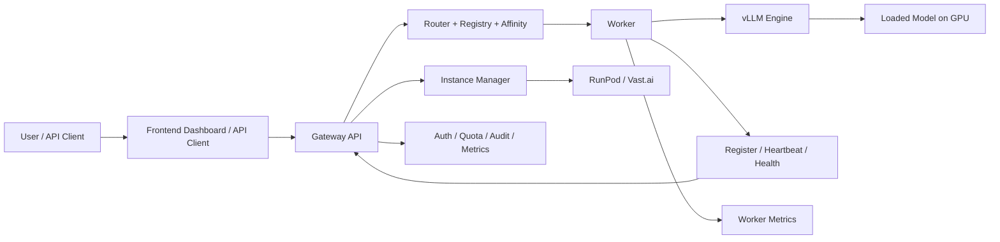
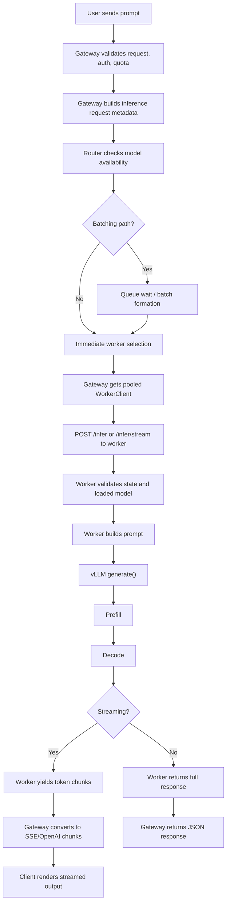
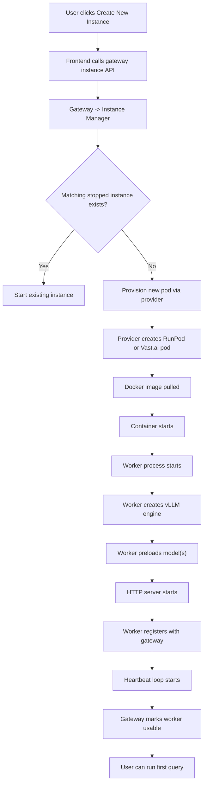
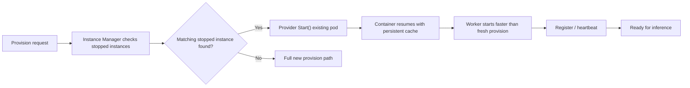
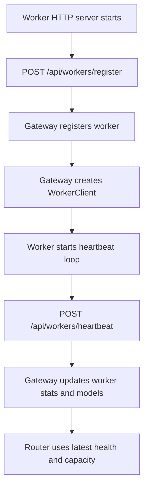
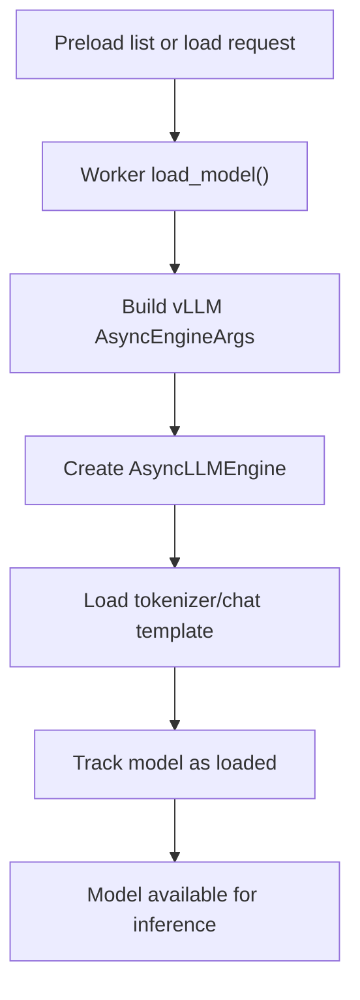
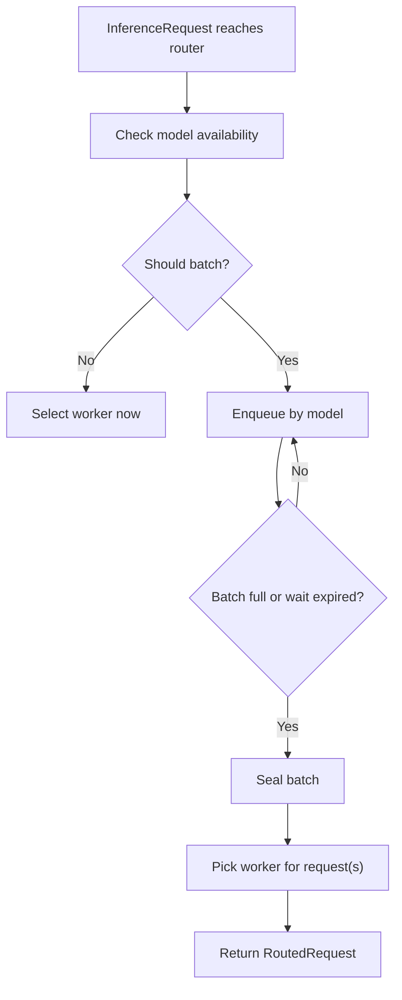
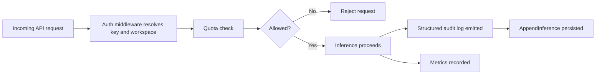
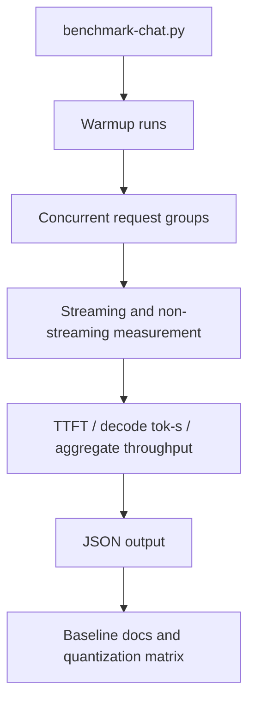

# Infera Product Pipelines

This document captures the current end-to-end pipelines in Infera and the main bottlenecks or optimization opportunities for each one.

It reflects the current implementation on `task/performance-optimization-execution`.

## 1. System Overview

## 2. Hot Inference Pipeline

### Current Bottlenecks

- Router batching still adds queue/wait overhead before worker selection for normal non-streaming requests, even when a single request could route immediately.
- Gateway audit persistence is still synchronous in the request path.
- Worker-side prompt build and tokenizer/template work still happens per request.
- We do not yet expose prefill-vs-decode timings directly, so some tuning is still indirect.

### Current Strengths

- Gateway-to-worker connections are pooled and reused.
- vLLM is already wired for prefix caching, chunked prefill, scheduler-step tuning, tensor parallelism, speculative decoding, `max_num_batched_tokens`, and `max_num_seqs`.
- Streaming is implemented end-to-end.

## 3. Streaming Response Pipeline

```mermaid
flowchart LR
    A["Gateway calls worker /infer/stream"] --> B["Worker calls vLLM generate()"]
    B --> C["First output arrives"]
    C --> D["Worker emits TokenChunk delta"]
    D --> E["Gateway wraps as OpenAI chunk"]
    E --> F["SSE flushed to client"]
    F --> G["Client renders partial output"]
    G --> H["Repeat until finish_reason"]
    H --> I["Gateway sends [DONE]"]
```

### Current Bottlenecks

- TTFT still includes gateway work, router delay, prompt formatting, and first vLLM prefill.
- Tail latency can still spike under affinity and concurrent load, as seen in recent `L40S` benchmarks.

## 4. Cold Start / New Instance Pipeline

### Current Bottlenecks

- Worker HTTP now starts before preload completes, but first-time image pull and first-time model download can still dominate startup time.
- Gateway registration still happens only after model preload completes, so the gateway cannot use staged startup states yet.
- Worker does extra tokenizer loading at model load time.

### Current Strengths

- Matching stopped-instance reuse already exists.
- RunPod persistent `/workspace` cache is already configured for Hugging Face, Torch, and related artifacts.

## 5. Stopped Instance Reuse Pipeline

### Current Bottlenecks

- Reuse is present, but we still need better measurement of reuse hit rate and restart-to-ready timings.
- Vast.ai does not yet have as clear a persistent-cache path as RunPod.

## 6. Worker Registration and Heartbeat Pipeline

### Current Bottlenecks

- Registration still begins only after model preload is complete from the gateway’s perspective; startup is now externally visible through `/health`, but the gateway does not yet receive staged startup heartbeats.
- Worker-side cold-start stage timestamps now exist, but provider-side milestones like `instance_running` still have to be correlated externally.

## 7. Model Load Pipeline

### Current Bottlenecks

- Tokenizer load is separate from engine creation and adds startup time.
- The worker now exposes staged startup timestamps for `server_started`, `model_load_started`, `model_load_finished`, `worker_ready`, and `gateway_registered`, but the gateway still only sees the worker after successful registration.

## 8. Routing and Batching Pipeline

### Current Bottlenecks

- Current batching is primarily queue/wait behavior at the router layer.
- Gateway still forwards one request per worker call; it is not sending a true combined gateway batch payload.
- The biggest latency risk here is unnecessary wait on low-contention traffic.

## 9. Auth, Quota, Audit, and Metrics Pipeline

### Current Bottlenecks

- Quota checks can add extra store work in the gateway path.
- Audit persistence is now asynchronous, but quota checks are still authoritative store reads on the hot path.
- This path is functionally correct and leaner than before, but still not fully minimized for hot latency.

## 10. Benchmark and Performance Measurement Pipeline

### Current Bottlenecks

- We now have strong warm-run benchmarking, but standard `RunPod A100` baseline capture is still incomplete.
- Worker-side cold-start stage timestamps are available now, but fresh provision, stop/start, and reused stopped-instance baselines still need to be captured.
- Prefill-vs-decode stage visibility is still not exposed directly from the worker/vLLM path.

## 11. Priority Optimization Order

If the goal is to improve performance with the highest leverage first, this is the current order:

1. Hot inference pipeline latency and throughput
2. Cold-start pipeline and restart path
3. Benchmark visibility and stage-level instrumentation
4. GPU/model/config performance matrix tuning

## 12. Immediate Next Actions

These are the most concrete next pipeline optimizations still available:

1. Add explicit prefill/decode stage instrumentation before deeper GPU/model matrix tuning.
2. Add cold-start stage instrumentation from provision request through first successful inference.
3. Benchmark and optimize the existing stop/start reuse path before building warm pools.
4. Extend staged readiness into gateway-visible startup metrics and routing policy.
5. Build the GPU/model/config performance matrix on top of the stabilized pipeline.
